# DeuceMate 🎾

**A reliable, privacy-focused tennis scoring app for Apple Watch — with iPhone companion for live viewing, announcements, and match history**

DeuceMate is a lightweight, native Apple Watch app for scoring tennis matches in real time, bundled with an **iPhone companion app** for live score viewing, umpire-style announcements, and a complete match archive with detailed statistics. Built from the ground up with SwiftUI, it delivers a fast, reliable scoring experience without the bloat, crashes, or privacy concerns of existing alternatives.

## Screenshots

| 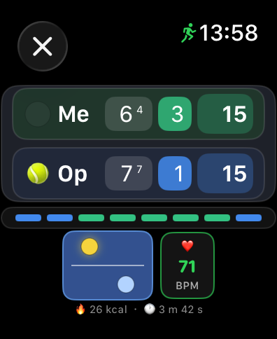 | 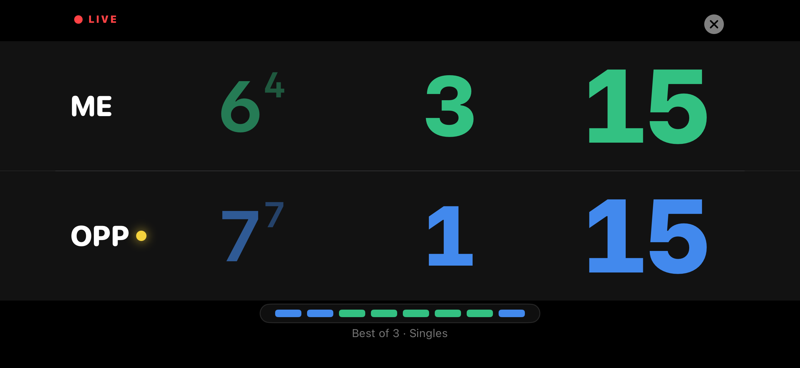 |
|:--:|:--:|
| **Gesture-first scoring, right on your wrist.** | **Watch it live on your phone — same score, real time.** |
| 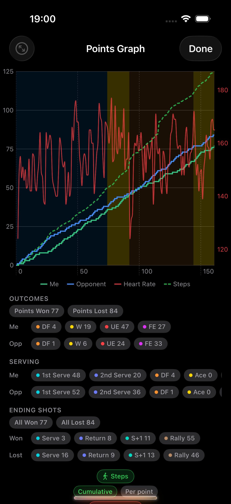 | 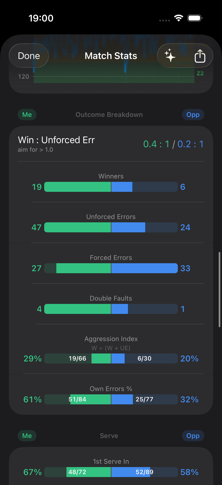 |
| **See your momentum — overlaid with heart rate and movement.** | **Pro-level analytics — 20+ stats, side by side.** |
| 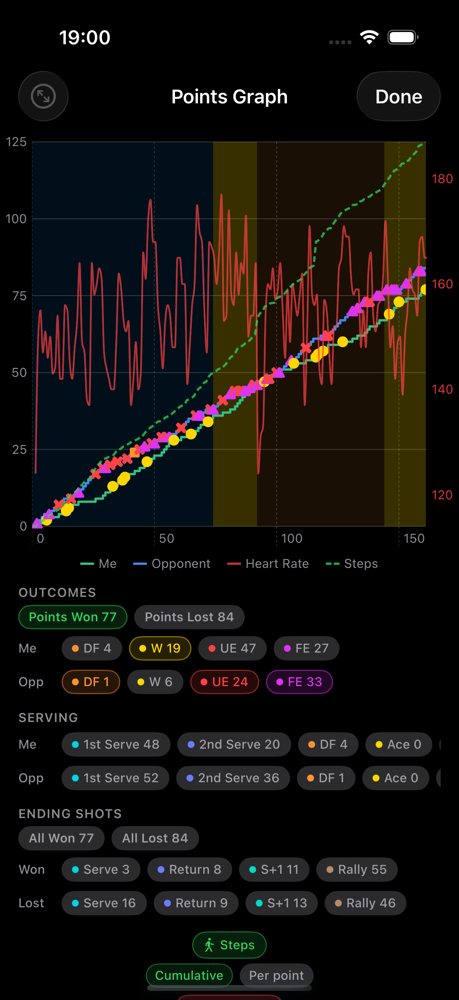 | 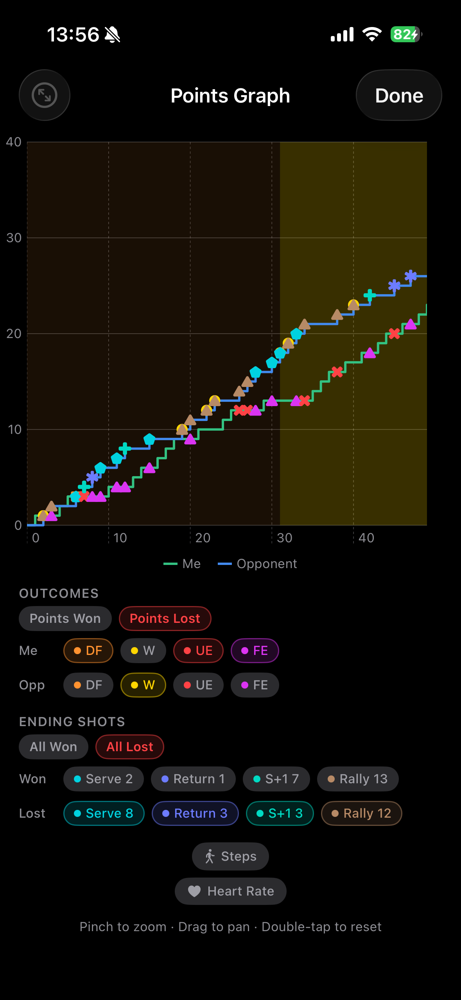 |
| **Filter to your winning points — see exactly where you took control.** | **Filter to lost points — pinpoint where the match slipped away.** |
| 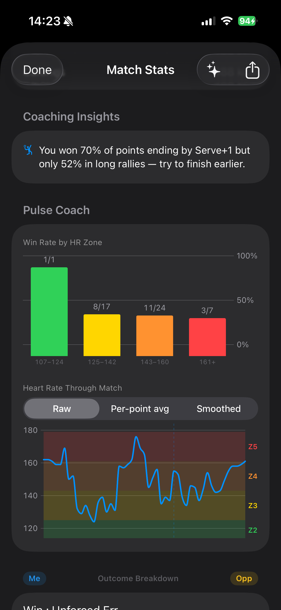 | 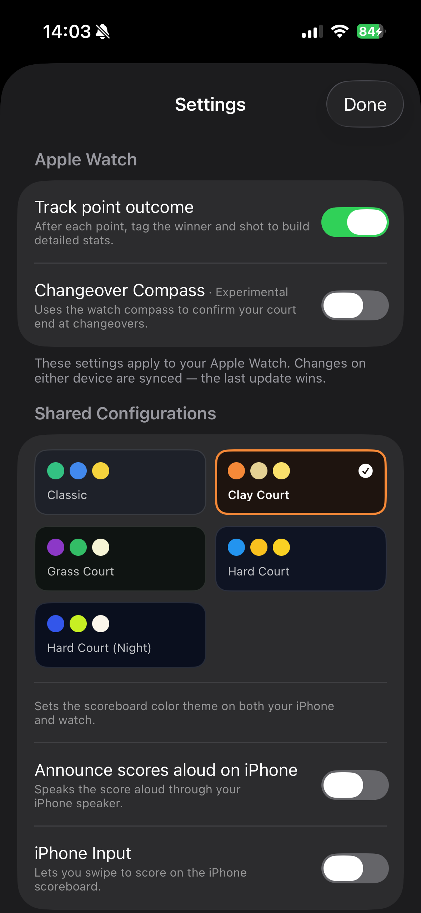 |
| **Discover the heart-rate zone you win in.** | **Five court-inspired themes.** |
| 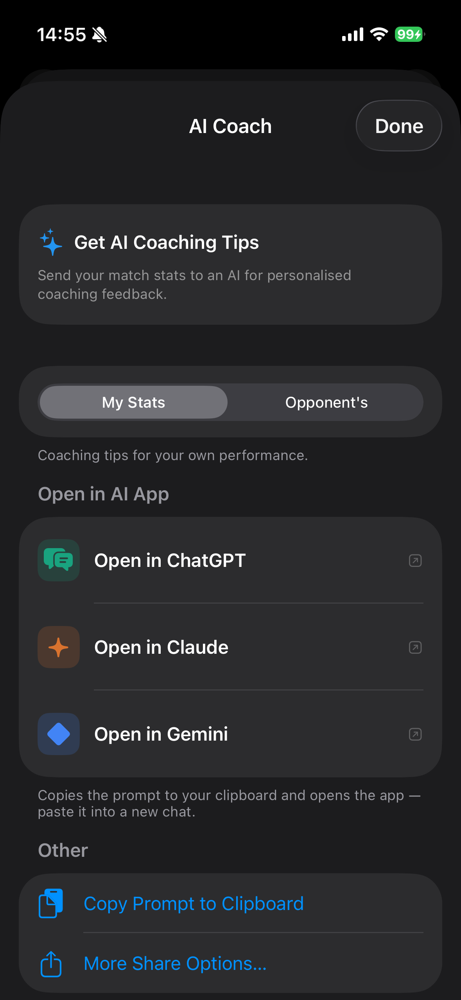 | 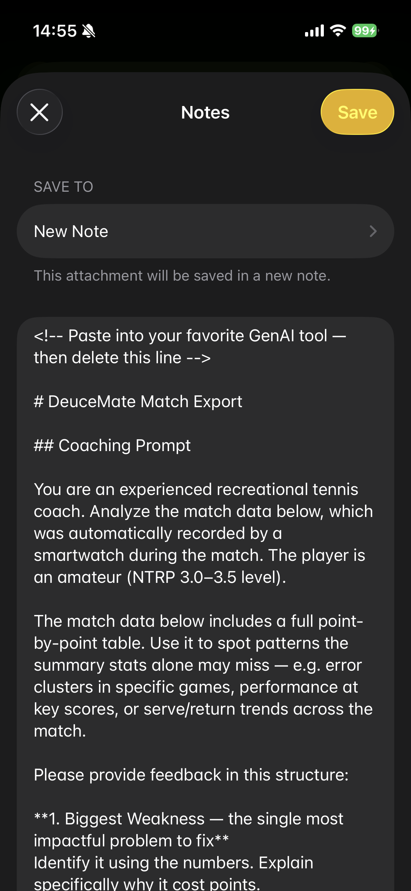 |
| **One tap to send your match data to an AI coach.** | **A structured prompt — with full context — ready for any AI.** |
| 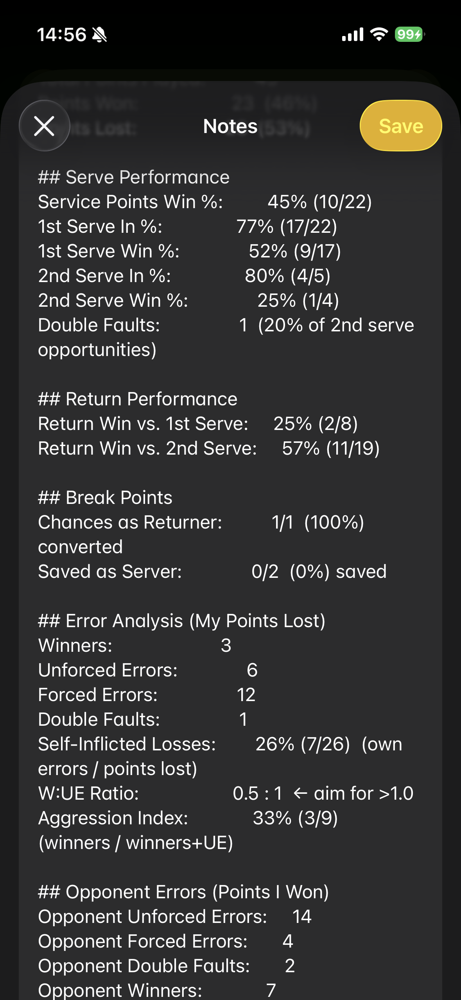 | 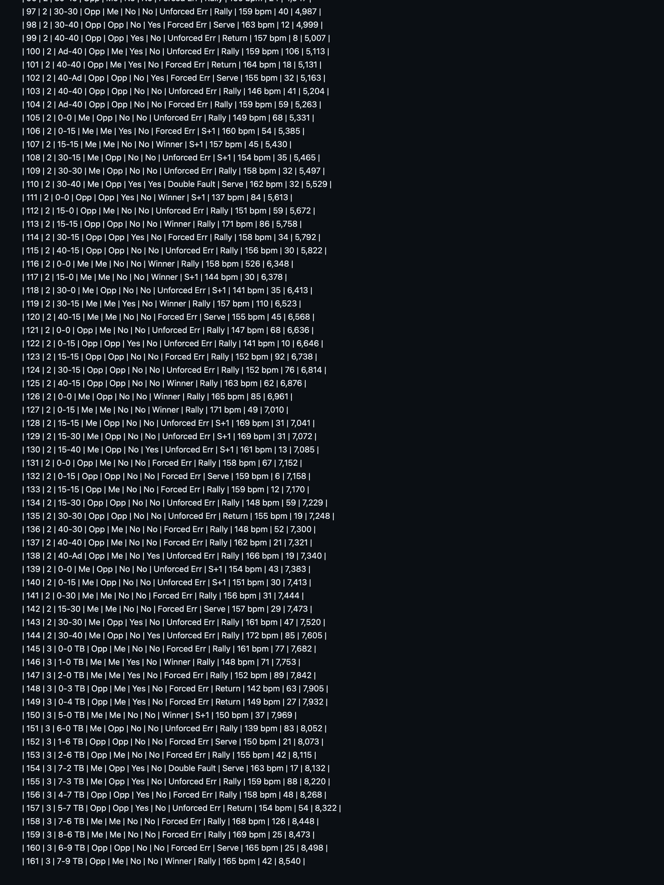 |
| **Complete stats analysis included automatically.** | **Every point, in order — so the AI spots patterns you missed.** |

## Why DeuceMate Exists

After trying multiple tennis scoring apps that crashed mid-match, collected unnecessary data, or required subscriptions with intrusive ads, I built DeuceMate to be:
- **Reliable** - Works offline with optimized battery usage
- **Private** - Zero data collection, no analytics, no tracking
- **Simple** - Clean interface focused on the essentials
- **Free** - No subscriptions, ads, or in-app purchases

This project also showcases my ability to ship production-quality native iOS/watchOS apps from concept to App Store — built end-to-end with an AI-agent development workflow (see [Development](#development)).

## Features

**Gesture-first scoring on Apple Watch**

| Gesture | Action |
|---------|--------|
| Swipe up | Award point to you |
| Swipe down | Award point to opponent |
| Double tap | Toggle second-serve context |
| Swipe left | Undo last point (full game-state rollback) |
| Swipe right | Open live stats view |

- **Complete tennis scoring** — games, sets, tiebreaks, deuce/advantage, automatic server rotation, break-point detection, and side-change prompts with a compass court-end badge. Six match formats; singles and doubles with full service-order management.
- **Bulletproof state** — full undo stack across game and set boundaries; in-progress matches survive backgrounding, notifications, and overnight pauses.
- **iPhone companion** — stadium-style live scoreboard, umpire-style spoken announcements, optional swipe-to-score iPhone Input, manual match entry, and an unlimited on-device archive.
- **Point outcome tracking** — tag every point with a cause and ending shot to unlock serve, return, break-point, pressure, rally-depth, and score-state analytics, filterable per set or whole match.
- **Coaching insights** — RecCoach (eight data-driven observations per match) and PulseCoach (heart-rate-correlated insights), plus an interactive points-momentum graph with HR and steps overlays.
- **AI coaching exports** — one tap builds a structured coaching prompt (including the raw point-by-point table) for ChatGPT, Claude, Gemini, and others, with a dual perspective mode so your opponent gets coached too.
- **Shareable interactive web report** — export any match as a single self-contained HTML page (momentum chart with toggleable outcome/shot scatter, the full Me-vs-opponent stats with Stats/Points tabs and per-set filters, and a built-in AI-coach launcher) that opens in any browser, fully offline — no app, account, or server.
- **Health & fitness** — optional HealthKit workout with live heart rate, calories, steps, distance, and per-set timers.
- **Five court-inspired themes**, momentum strip, and point-confirm highlight — all synced between watch and iPhone.

📖 **[User Guide](docs/USER_GUIDE.md)** — the full reference: every gesture, format, statistic, coaching rule, and export mode, plus battery numbers, padel compatibility, and a refresher on tricky tennis rules.

## Privacy

DeuceMate collects **zero data** — no servers, no analytics, no tracking, and no network requests at all. Match data stays on your devices; export and AI-coaching features share data only when you explicitly choose to. See [PRIVACY_POLICY.md](PRIVACY_POLICY.md) (also published at [emrahman.github.io/DeuceMate/privacy.html](https://emrahman.github.io/DeuceMate/privacy.html)).

## Requirements & Installation

- Apple Watch Series 4 or later (including SE and Ultra), watchOS 9.0+
- iPhone running iOS 17.0+ (the watch app is bundled with the iOS app)
- **App Store:** submission in progress — coming soon

## Support & Feedback

- 🌐 Support site: [emrahman.github.io/DeuceMate](https://emrahman.github.io/DeuceMate/)
- 📧 Email: [mail@ehsanrahman.com](mailto:mail@ehsanrahman.com?subject=DeuceMate%20Feedback)
- 🐛 Report issues: [GitHub Issues](https://github.com/EMRahman/DeuceMate/issues)
- 📖 Help & FAQs: [SUPPORT_PAGE.md](SUPPORT_PAGE.md)

## Development

Native SwiftUI on both platforms with **zero third-party dependencies** — Apple frameworks only (WatchConnectivity, HealthKit, AVFoundation, CoreMotion/CoreLocation, Swift Charts). All portable logic — models, the pure scoring engine, stats derivation, the sync wire format, and merge policy — lives in the shared `DeuceMateCore` Swift package with comprehensive unit tests. The watch is the source of truth for live matches; the iPhone is the durable read-only archive, synced over WatchConnectivity with queue-and-deliver semantics.

**AI-agent workflow:** the repo is deliberately structured for agentic development — [`CLAUDE.md`](CLAUDE.md) is the operating guide coding agents follow (architecture map, multi-site change recipes, known traps), [`docs/architecture/`](docs/architecture/) holds the component, sync, and match-lifecycle diagrams agents keep current, and [`docs/features/TECHNICAL_DEBT.md`](docs/features/TECHNICAL_DEBT.md) is the prioritised backlog they work from. Changes land as agent-authored PRs held to the rules in [`CONTRIBUTING.md`](CONTRIBUTING.md).

Architecture documentation: [`docs/architecture/`](docs/architecture/) — component topology, sync and data-flow, match lifecycle, and a complete file inventory.

## Contributing

Contributions are welcome! Please feel free to:
- Open issues for bugs or feature requests
- Submit pull requests with improvements
- Share feedback from using the app

See [CONTRIBUTING.md](CONTRIBUTING.md) for conventions.

## License

This project is licensed under the MIT License - see the [LICENSE](LICENSE) file for details.

## Author

**Ehsan Rahman**
🌐 [ehsanrahman.com](https://ehsanrahman.com)
💼 [GitHub](https://github.com/EMRahman)

---

**Built with ❤️ for tennis players worldwide 🎾**

*This project showcases production-quality native iOS/watchOS development. Available on the App Store soon.*
