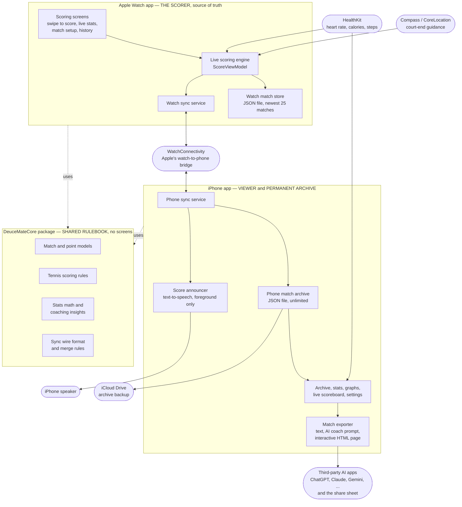

# DeuceMate — Architecture Map (start here)

This folder is the **non-coder's guide to what is inside DeuceMate**. It exists so the
owner can review the system — and review *changes* to the system — without reading
Swift. Everything here is written in plain English and rendered by GitHub directly
(the diagrams are [Mermaid](https://mermaid.js.org/) blocks inside Markdown, so they
stay diffable and AI assistants can update them alongside code changes).

**The five documents:**

| Document | Question it answers |
|---|---|
| **README.md** (this file) | What are the big pieces and how do they connect? *(the topology map)* |
| [file-inventory.md](file-inventory.md) | What does every single file do, and which feature does it serve? *(the review guardrail)* |
| [sync-and-data-flow.md](sync-and-data-flow.md) | What exactly travels between the watch and the phone, and in which direction? |
| [match-lifecycle.md](match-lifecycle.md) | What happens to one tennis match from first point to AI coaching export? |
| [health-data-flow.md](health-data-flow.md) | Where does HealthKit data go, and where is it stripped, excluded, or gated? *(the App Store 5.1.3(ii) map)* |

---

## What DeuceMate is

A tennis-scoring app in **three software components** built with Apple frameworks only
(zero third-party dependencies, by rule):

1. **Apple Watch app** — where matches are scored, by swiping. It is the **source of
   truth** for every match: scoring rules, undo, serve rotation, tiebreaks, workout
   tracking. It keeps only the **25 most recent matches** locally.
2. **iPhone companion app** — a viewer and a **permanent archive**. Live scoreboard,
   spoken score announcements, match history, statistics, graphs, coaching insights,
   and export to AI chat apps. It never invents match data; it receives it from the watch.
3. **DeuceMateCore** — a shared "rulebook" package used by both apps. It holds the
   data models, the tennis scoring rules, the statistics math, and the sync wire
   format. It has **no screens** — pure logic, which is why almost all automated
   tests live against it.

## The topology map

**How to read it:** solid arrows are data moving at runtime; dotted arrows mean
"built on top of". Rounded nodes are systems *outside* DeuceMate's code — Apple
services and other apps.

The `HealthKit → … → iCloud Drive` path carries a compliance requirement of its
own (health data must never reach iCloud). Exactly where it is stripped, excluded,
or gated is mapped in [health-data-flow.md](health-data-flow.md).

## The five ownership rules

These invariants explain almost every design decision; a change that violates one
should be challenged in review:

1. **The watch owns match data.** Match results flow one way: watch → phone. The
   one deliberate exception is manual match entry: the phone builds the record,
   saves it straight into its own archive, and sends a copy to the watch so the
   match can be resumed and scored there. Outside that flow, the phone never
   authors or edits a match result.
2. **The phone is the permanent archive.** The watch keeps only its newest 25
   matches; the phone keeps everything it has ever received in an on-device
   store that the UI always reads from, with a background backup in the user's
   own iCloud Drive. iCloud can restore a newly initialized local archive, but
   after that match data continues one way: watch → phone → iCloud.
3. **Settings sync both ways, last-write-wins.** Theme, announcements, player name,
   heart-rate settings, etc. — whichever device changed a setting most recently wins.
   Match data never merges this way (see rule 1).
4. **The phone may only *suggest* score actions.** With the "iPhone Input" setting
   on, a spectator can swipe on the phone scoreboard — but that sends a *command*
   to the watch, which validates it (right match? input allowed?) and applies it
   itself. The watch's record remains the truth.
5. **Archived match files must decode forever.** Saved match JSON is never broken
   by new fields; every new field gets a default so years-old matches still open.

## Maintenance contract (the review guardrail)

> **Any pull request that adds, removes, renames, or repurposes a source file MUST
> update [file-inventory.md](file-inventory.md) in the same pull request.**

This is the mechanism that catches unrequested or unnecessary files: when reviewing
a PR, look at the inventory diff first. A new file with no inventory entry — or an
inventory entry whose stated purpose doesn't match the feature you asked for — is a
red flag, no code reading required. The same rule is stated in `CLAUDE.md` so AI
coding agents are bound by it.

For deeper background, the original feature design documents live in
[`docs/features/`](../features/) (companion app plan, changeover compass plan,
dual-device broadcast plan, technical-debt register).
