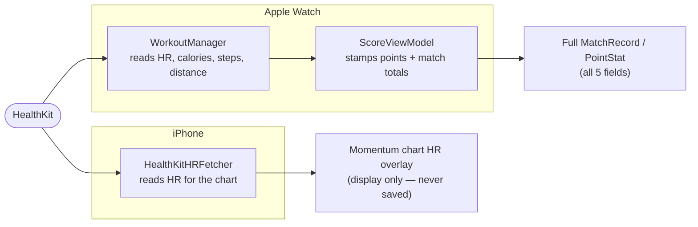
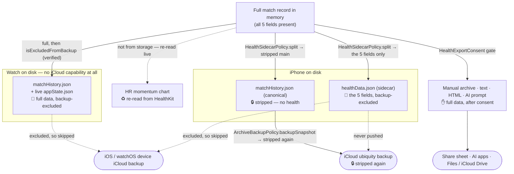
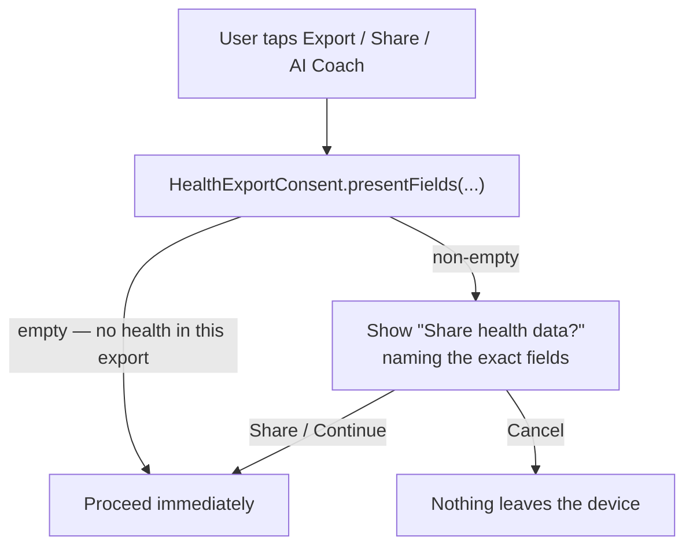

# Health Data Flow — where HealthKit data goes, and where it is stripped, excluded, or gated

This is the one place that maps **every destination a piece of HealthKit data can
reach** and what protects it there. It exists because the rule below is easy to
break by accident: a future change that adds a new "save" or "share" path can
silently leak health data into a backup and put the app out of compliance.

> **Apple App Store Review Guideline 5.1.3(ii):** HealthKit data *must not* be
> stored in iCloud (or any cloud backup). It *may* leave the device when the user
> deliberately exports or shares it and has been told what is included.

DeuceMate honours this with **one invariant**:

> **Health data lives only in memory and in device-local, backup-excluded files.
> It is _stripped_ at every boundary that leads to iCloud, and it only leaves the
> device through a _user-consented_ export.**

There are therefore exactly four ways health data is handled, and every sink in
this document is one of them:

| | Mechanism | Meaning | Used for |
|---|---|---|---|
| 🔒 | **STRIPPED** | The five fields are set to `nil` before the bytes are written. | The phone's canonical on-disk history; the iCloud backup copy. |
| 🚫 | **BACKUP-EXCLUDED** | Full data on disk, but the file is flagged `isExcludedFromBackup` (+ file protection) so no device iCloud/finder backup copies it. | The phone's Health sidecar; the watch's history and live-state files. |
| ✋ | **CONSENT-GATED** | Full data, released only after the user confirms a disclosure that names exactly what is included. | Manual archive export; text / HTML / AI-prompt shares; AI Coach hand-off. |
| ♻️ | **RE-DERIVED** | Read fresh from HealthKit for display; never persisted, so never a backup risk. | The phone's heart-rate momentum chart. |

Related reading: [sync-and-data-flow.md](sync-and-data-flow.md) §6 (manual archive),
[match-lifecycle.md](match-lifecycle.md) stages 6–8,
[`ICLOUD_BACKUP_HARDENING_PLAN.md`](../features/ICLOUD_BACKUP_HARDENING_PLAN.md),
[`HEALTH_EXPORT_CONSENT_PLAN.md`](../features/HEALTH_EXPORT_CONSENT_PLAN.md), and
[`SECURITY_REVIEW_2026-06.md`](../security/SECURITY_REVIEW_2026-06.md) §3.3.

---

## 1. The five HealthKit-derived fields

Everything in this document is about exactly five stored values. Three are
match-level totals on `MatchRecord`; two are per-point snapshots on `PointStat`.

| # | Field | Type | Model | Meaning |
|---|---|---|---|---|
| 1 | `totalSteps` | `Int?` | `MatchRecord` | Step count over the match |
| 2 | `totalDistanceMeters` | `Double?` | `MatchRecord` | Distance walked/run |
| 3 | `totalCaloriesKcal` | `Double?` | `MatchRecord` | Active + basal calories |
| 4 | `heartRateBPM` | `Int?` | `PointStat` | Heart rate at that point |
| 5 | `stepsCumulative` | `Int?` | `PointStat` | Running step total at that point |

The single canonical way to remove them is `MatchRecord.strippingHealthData()`
(which maps its points through `PointStat.strippingHealthData()`); the inverse is
`fillingMissingHealthData(from:)`, which backfills **only** where the target field
is `nil` and never overwrites an existing value. Derived heart-rate *zones* are
computed on the fly from `heartRateBPM` and are never stored, so they are not a
sixth field — but they *are* disclosed as a distinct item in user exports (see §4).

All five use the `decodeIfPresent` + default backward-compat recipe, so a
stripped record (missing all five keys) still decodes cleanly. See
[CLAUDE.md](../../CLAUDE.md) §4 before adding a sixth field.

---

## 2. Where health data comes from

- **Watch (the only writer of stored health data).** `WorkoutManager` runs an
  `HKWorkoutSession` for the match and reads heart rate, calories, steps, and
  distance. `ScoreViewModel` stamps `heartRateBPM`/`stepsCumulative` onto each
  tracked point and attaches the three totals when the match is finalised.
- **Phone (read-only, display only).** `HealthKitHRFetcher` reads heart-rate
  samples straight from HealthKit to draw the momentum-chart overlay. It **never
  writes** into any store — so the phone re-derives HR for display (♻️) rather
  than depending on backed-up values. This is why stripping health from the
  phone's archive costs the user nothing visible.

---

## 3. The master map — every sink and its protection

**How to read it:** solid arrows carry health data through a transform named on
the edge; dotted arrows are paths health data deliberately does **not** take.
Every arrow into iCloud passes through a strip; every file that keeps full data
is backup-excluded; the only full-fidelity release is user-gated.

### Sink-by-sink

| Sink | Protection | Enforced by | Guarded by test |
|---|---|---|---|
| Phone canonical `matchHistory.json` | 🔒 stripped | `HealthSidecarPolicy.split` inside `PhoneStatsStore.writeCanonicalOnQueue` | `HealthSidecarPolicyTests`, `PhoneStatsStoreTests` |
| Phone Health sidecar `healthData.json` | 🚫 excluded | `PhoneStatsStore.excludeFromBackup` (verify-or-discard) | `PhoneStatsStoreTests` |
| iCloud ubiquity backup | 🔒 stripped again | `ArchiveBackupPolicy.backupSnapshot` inside `PhoneStatsStore.pushBackupOnQueue` | `ArchiveBackupPolicyTests` |
| Watch `matchHistory.json` | 🚫 excluded | `StatsStore` → `BackupExcludedFileWriter` | `StatsStoreTests` |
| Watch live `appState.json` | 🚫 excluded | `ScoreViewModel.saveState` → `BackupExcludedFileWriter` | *(none dedicated — see §6)* |
| Manual archive export | ✋ gated | `HealthExportConsent` + `ManualMatchArchiveBackup` | `ManualMatchArchiveBackupTests`, `HealthExportConsentTests` |
| Text / HTML / AI-prompt share | ✋ gated | `HealthExportConsent` + `MatchExporter` / `WebExport` | `MatchExporterTests`, `MatchWebExportTests`, `HealthExportConsentTests` |
| AI Coach hand-off | ✋ gated | `HealthExportConsent` (at sheet entry) + `AICoachLauncher` | `HealthExportConsentTests`, `DeuceMateUITests` |
| HR momentum chart | ♻️ re-derived | `HealthKitHRFetcher` (never persists) | — (nothing stored) |

---

## 4. The two backup paths, and why the watch is safe by construction

Two *different* mechanisms keep health out of *two different* clouds:

1. **The app's own iCloud backup copy** (the "Backed up to iCloud" archive) is
   kept clean by **stripping**, not exclusion. Health is removed twice on the way
   out: once by `HealthSidecarPolicy.split` before the canonical file is written,
   and again by `ArchiveBackupPolicy.backupSnapshot` before the push into the
   ubiquity container. The Health sidecar file is **never** among the files
   pushed. The leak guard is a test that encodes the snapshot to JSON and asserts
   **none of the five key names appear anywhere in the tree**
   (`ArchiveBackupPolicyTests`).
2. **The general iOS/watchOS device iCloud backup** is kept clean by
   **exclusion**. Every file that still holds full health data — the phone Health
   sidecar, the watch history, the watch live-state — is written with
   `isExcludedFromBackup = true` (re-verified on every write and re-applied on
   launch) plus `.completeFileProtectionUntilFirstUserAuthentication`.

**The watch cannot leak to iCloud at all.** Its entitlements contain only
HealthKit — no iCloud/ubiquity keys — and there is no iCloud code in the watch
target. Health data reaches the cloud story *only* via the phone, which is
exactly where the two strips live.

> Note: the **WatchConnectivity** transfer watch → phone is full-fidelity and
> device-to-device. That is not a backup and is out of 5.1.3(ii) scope — it is
> simply *how the phone comes to hold health data that it then strips.* The merge
> uses `MatchRecord.fillingMissingHealthData` so a late live checkpoint can heal a
> finalized record's health without inventing values.

---

## 5. User-gated exports and the consent disclosure

Exports are **deliberately full-fidelity** — losing your own heart rate when you
send a match to a coach would defeat the point. What protects the user is an
informed, per-export disclosure. The product decision (see
[`HEALTH_EXPORT_CONSENT_PLAN.md`](../features/HEALTH_EXPORT_CONSENT_PLAN.md)) is a
two-way **"Share health data?" → Share / Cancel** dialog shown every time an
export would carry any of the five fields; there is no stripping option and no
"don't ask again".

The single source of truth is Core's `HealthExportConsent`:

- `presentFields(in:focal:includesRawPoints:)` returns exactly which health
  categories a given export would expose — so the disclosure names them precisely
  and is **skipped entirely** when the set is empty.
- `disclosure(fields:destination:)` builds the title + message once, so every
  surface stays consistent.

The four gated surfaces:

| Surface | Entry point | Recorder-only? |
|---|---|---|
| **Manual archive** (Settings → Backup & Transfer) | `SettingsView` `.alert` → `.fileExporter` → `ManualMatchArchiveBackup` | Raw records; carries HR/steps/distance/calories but never derived zones |
| **Text summary / full report** | `MatchDetailView.beginShare` → "Share health data?" `.alert` → `ShareSheet` | HR / zones / PulseCoach / movement are `focal == .me` only; step/calorie/distance totals appear for both perspectives when > 0; per-point HR/steps only via the raw-point table |
| **Interactive HTML page** | `MatchDetailView.beginShare` (same gate) | HR/steps blocks built from the recorder summary only |
| **AI Coach hand-off** | `MatchDetailView.beginAICoach` — gated **at sheet entry**, so every launch/copy/share inside `AICoachSheet` sits behind one affirmative step | Recorder HR; opponent prompt tells the AI the HR/steps belong to the recorder |

**Recorder-only rule (why it matters):** heart rate belongs to the person wearing
the watch. It is never mapped onto the opponent's win rates (that would be
physiologically meaningless), so the opponent perspective exposes HR *only* as a
raw column labelled "Opponent HR", and never the derived zones. `presentFields`
encodes this exactly, and `MatchExporterTests` / `MatchWebExportTests` assert the
export output agrees with what `presentFields` promises.

---

## 6. Test coverage — what is guarded, and the remaining gaps

**Stripping before iCloud**
- `ArchiveBackupPolicyTests` — the backup snapshot's JSON contains none of the
  five key names; `strippingHealthData()` nils exactly five fields and is
  idempotent; restore backfills health from the local checkpoint.
- `HealthSidecarPolicyTests` — split→merge is a full-fidelity identity; the
  stripped main projects none of the five keys; empty projections are omitted.
- `PhoneStatsStoreTests` — the persisted main history is health-stripped; the
  sidecar is `isExcludedFromBackup` while the main is **not**; exclusion is
  re-applied on every write; an exclusion failure discards health but still
  persists the stripped archive; a corrupt sidecar is quarantined.
- `MatchMergePolicyTests` — a winning completed record backfills incoming health.

**Backup exclusion on disk**
- `StatsStoreTests` (watch) — the history file round-trips and is
  `isExcludedFromBackup`; exclusion is re-applied on repeated writes and on
  upgrade.

**User exports & consent**
- `ManualMatchArchiveBackupTests` — the manual archive round-trips **with** all
  five fields and flags `includesHealthData` for the disclosure preview.
- `HealthExportConsentTests` (Core) — `presentFields` per perspective (zones
  recorder-only; zero totals excluded; empty ⇒ skip); disclosure copy fidelity and
  recipient clauses; agreement between `presentFields(.me)` and the recorder-framed
  **HTML** export.
- `MatchExporterTests` (iOS target) — the plain-text / AI-prompt exporter's health
  content: recorder-only HR/zones/movement, both-perspective totals only when > 0,
  per-point HR/steps only via the raw table, the opponent-prompt disclaimer, and
  **agreement between `presentFields` and what each export string actually emits**
  for `.me`/`.opponent` × summary/full. *(This is the `MatchExporter` half of the
  disclosure↔export cross-check; it must live in the iOS target because
  `MatchExporter` is app-side and Core tests cannot import it.)*
- `MatchWebExportTests` — HR is recorder-only; no HR ⇒ no HR/steps/totals blocks;
  the page loads **zero** external resources; AI links are opt-in navigations only.
- `DeuceMateUITests` — the negative gate (a health-free match shows **no**
  disclosure and shares directly) and, seed-gated, the positive gate (a
  health-bearing seeded match shows "Share health data?" before sharing).
- `MatchRecordCodingTests` — HR/steps round-trip and decode pre-feature JSON as
  `nil`. `ICloudBackupCopyTests` — the "Backed up to iCloud" status truth table.

**Known remaining gaps (intentionally not closed here)**
- The watch **live-state** `appState.json` exclusion has no *dedicated* test. The
  shared writer (`BackupExcludedFileWriter`) is exercised transitively by the
  watch history tests, and it verifies exclusion or throws — but a direct
  assertion on the live-state file would be a cheap addition.
- The **positive** iOS consent-gate UI test is **seed-gated**: because health data
  only comes from a real watch-recorded match, the test seeds a health-bearing
  match via the existing `DeuceMateArchiveTool seed` /
  `DEUCEMATE_TARGET_MATCH_ID` mechanism (see
  [docs/screenshots/README.md](../screenshots/README.md)) and **skips cleanly**
  when the archive is not seeded. It is therefore not an always-on guard; the
  disclosure *logic* is fully covered by `HealthExportConsentTests`.

---

## 7. Rules for future changes (protect the requirement)

Before you touch anything in this map, know these:

- **Adding a sixth health-derived field?** It must be nilled by
  `MatchRecord.strippingHealthData()` **and** projected by `HealthSidecarPolicy`
  **and** declared in `HealthExportConsent` (`HealthExportField` +
  `presentFields`). Extend `ArchiveBackupPolicyTests` (JSON key-absence),
  `HealthSidecarPolicyTests`, and the disclosure tests. A field added to the model
  but not to the stripper is an immediate 5.1.3(ii) leak.
- **Adding a new export / share surface?** Route it through
  `MatchDetailView.beginShare` / `beginAICoach` (or the `SettingsView` archive
  alert) so it inherits the `HealthExportConsent` gate. **Never** hand-roll a bare
  `ShareLink` on health-bearing content — the whole point of the alert is that the
  tap can be interrupted for disclosure.
- **Never push the Health sidecar to iCloud**, and never add iCloud/ubiquity
  entitlements to the watch target. The two strips + exclusion assume the watch is
  cloud-free and only `matchHistory.json` + tombstones are pushed.
- **The iCloud snapshot JSON key-absence test is the leak guard.** If you change
  the backup snapshot shape, keep that assertion — it is the last line of defence
  and the thing an App Store reviewer effectively re-checks.
- **Keep exports full-fidelity but disclosed.** The manual archive and share paths
  are *supposed* to carry health; the compliance boundary there is the user
  consent, not stripping. Do not "fix" them by stripping — fix them by making the
  disclosure accurate (`HealthExportConsent` is the single source of truth).
