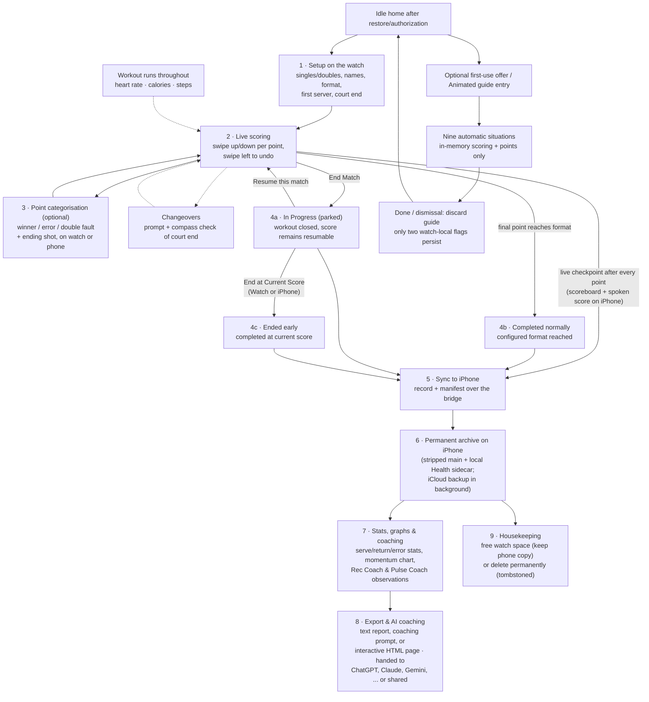
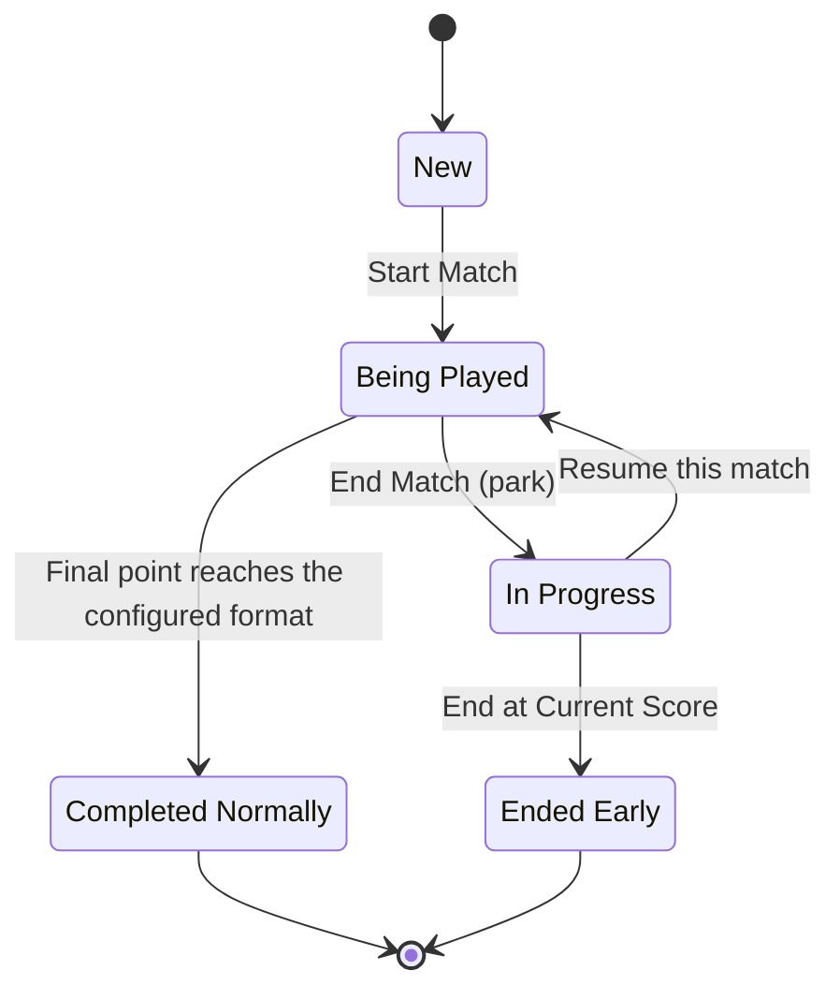

# Match Lifecycle — the journey of one tennis match

This is the end-to-end story of a single match, from the first swipe to an AI
coaching conversation, with the responsible files named at each stage (each is
described in the [file inventory](file-inventory.md)).

## Match status lifecycle

This is the persisted state machine behind the journey above. **End Match** and
**End at Current Score** deliberately mean different things:

- **New** — setup exists, but scoring has not started.
- **Being Played** — the match is live on the Watch; point checkpoints are saved
  locally and mirrored to the iPhone.
- **In Progress** — play has been parked by **End Match**. It remains resumable
  and retains the same match identity, score, server, timing, and point history.
- **Completed Normally** — the configured match format reached its normal win
  condition on a final point.
- **Ended Early** — the player selected **End at Current Score** from the
  in-progress match detail on Watch or iPhone. The stored score is finalized;
  sets, then games, then current points decide the leader, and a level score is
  a completed draw. This state cannot be resumed.

Both completed routes persist the same completed `MatchRecord` shape. “Completed
Normally” and “Ended Early” describe how it got there; they are not separate
long-term archive statuses.

## Stage by stage

**1 · Setup (watch).** The player picks singles or doubles, names, the match
format (six supported, from best-of-3 to perpetual tiebreak — the rules are
data-driven in `ScoreTypes`), who serves first, and confirms the court end if the
compass feature is on. A HealthKit workout session starts automatically with the
match (given HealthKit permission).
*Files: `HomeView`, `ScoreViewModel`, `WorkoutManager`.*

**2 · Live scoring (watch).** Each swipe becomes "player X won a point" and is fed
through the shared tennis rulebook (`ScoringEngine`), which returns the new score
plus events: game won, set won, tiebreak started, changeover due. Undo rolls the
whole game state back. After every point the watch saves a checkpoint locally
(crash-safe: the match can be resumed) and sends it to the phone, which updates
the live scoreboard and — if enabled and on screen — speaks the score.
*Files: `ContentView`, `ScoreViewModel`, `ScoringEngine`, `StatsStore`,
`WatchMatchSyncService` → `PhoneMatchSyncService`, `LiveScoreboardView`,
`LiveAnnouncementService`.*

**3 · Point categorisation (optional, watch or phone).** With outcome tracking on,
a sheet asks how the point ended (winner, forced error, unforced error, double
fault) and on which shot. The same pending point is mirrored to the phone so a
spectator can tag it instead. Each tagged point also snapshots the player's heart
rate and step count — the raw material for all statistics and coaching.
*Files: `PointCategorySheet` (watch), `LivePointCategoryPanel` (phone),
`PointStat` (the data).*

**Throughout: workout & changeovers.** The workout session collects heart rate,
calories, steps and distance; at changeovers the watch prompts the players and can
use the compass to confirm they're heading to the correct end.
*Files: `WorkoutManager`, `ScoreViewModel`, `ContentView`.*

**4 · Stop or finish (watch).** A final point completes the configured format.
The live **End Match** action instead closes the workout and parks the current
score as an in-progress record, preserving the existing resume flow. From that
record's history detail, **End at Current Score** explicitly completes it: sets,
then games, then current game/tiebreak points determine the leader; a level score
is a completed draw. The watch keeps only its newest 25 matches — older ones roll
off (the phone keeps them; see stage 6). *Files: `HomeView`, `MatchStatsView`,
`ScoreViewModel`, `ScoringEngine`, `WorkoutManager`, `StatsStore`, `WatchHistoryCap`.*

**5 · Sync (watch → phone).** The finished record, an "active match over" signal
and the watch's manifest (which match IDs it still holds) go to the phone. The
merge rules (`MatchMergePolicy`) guarantee a finished match can never be
overwritten by stale data, and deleted matches stay deleted (tombstones). Details
in [sync-and-data-flow.md](sync-and-data-flow.md).
*Files: `WatchMatchSyncService`, `PhoneMatchSyncService`, `MatchMergePolicy`,
`MatchSyncTransport`.*

**6 · Archive (phone).** The match joins the permanent archive. Full records are
kept in memory, while disk persistence is split into a normally backed-up,
health-stripped match history and a backup-excluded sidecar containing only
heart rate, steps, distance, and calories. A background backup in the user's own
iCloud Drive (status shown as "Backed up to iCloud") also contains only the
stripped records. iCloud can restore during initial local archive setup; after
that it receives pushes from the phone and does not merge back. Sidecar rules
live in `HealthSidecarPolicy`; cloud rules live in `ArchiveBackupPolicy`.
The list shows where each match lives: both devices, phone only, or watch only.
*Files: `PastMatchesView`, `PhoneStatsStore`, `HealthSidecarPolicy`, `ArchiveBackupPolicy`,
`ICloudBackupCopy`, `MatchStorageLocation`, `WatchMirror`.*

**7 · Stats, graphs & coaching (phone).** The match page derives everything from
the tagged points: serve/return/break-point stats, error profile, pressure-point
performance (`MatchStatsSummary`); a momentum chart with optional heart-rate and
step overlays fetched from HealthKit; "Rec Coach" observations (from at least 20
tagged points) and "Pulse Coach" heart-rate observations (from at least 10
HR-tagged points). *Files: `MatchDetailView`, `PointsGraphView`,
`HealthKitHRFetcher`, `MatchStatsSummary`, `RecCoachInsights`/`RecCoachSection`,
`PulseCoachInsights`/`PulseCoachSection`.*

**8 · Export & AI coaching (phone).** The player can export a text summary, a full
point-by-point report, or an AI coaching prompt tuned to their skill level, and
hand it straight to an installed AI chat app (ChatGPT, Claude, Gemini, Perplexity,
Copilot, Poe, Grok) or the share sheet. They can also share a self-contained
interactive HTML page of the match — built off-thread and shared as a `.html` file —
with the momentum chart and set bands, a Stats/Points tab toggle, All/Set N filters, a
TV-style Me-vs-Opp comparison, a point-by-point list, and an optional AI Coach card.
The page loads zero external resources and is recorder-framed; progressive enhancement
ships a static, no-JS report so even iOS Quick Look shows a readable preview.
Whenever an export would carry HealthKit data (heart rate, steps, calories,
distance), a per-export **"Share health data?"** disclosure names exactly what is
included and the user confirms before it leaves the device — the deliberate,
consented exception to "health never leaves the device unstripped." The disclosure
is skipped for a health-free match. See [health-data-flow.md](health-data-flow.md)
for the full strip / exclude / gate map.
*Files: consent gate — `HealthExportConsent` (Core), `MatchDetailView` (`beginShare`/`beginAICoach`);
text/AI export — `MatchExporter`, `AICoachSheet`, `AICoachLauncher`; HTML export —
`MatchDetailView` (share action) + Core `WebExport/` (`MatchWebViewModel`(+`Build`/`Comparison`/`AICoach`),
`MatchHTMLExporter`, `MatchWebTemplate`, `MatchWebStaticFallback`, `WebExportColors`);
see [INTERACTIVE_HTML_EXPORT_PLAN.md](../features/INTERACTIVE_HTML_EXPORT_PLAN.md).*

**9 · Housekeeping.** From the phone the user can free up watch space (delete from
the watch, keep the archive copy — the badge flips to "phone only") or delete a
match permanently (tombstoned so no future sync resurrects it). A watch-only match
can be pulled back into the phone archive at any time.
*Files: `PastMatchesView`, `PhoneStatsStore`, `PhoneMatchSyncService`.*

## Side journeys: phone-authored archive actions

Manual entry reconstructs a match from a paper scorecard or watch mishap. The
form saves it **directly into the phone archive** and sends a copy to the watch,
where it can be resumed and scored normally.

An in-progress iPhone archive detail also offers **End at Current Score**. The
phone completes its stored checkpoint and reliably sends that version to a
watch known to hold the match. If the same identity is currently live there,
the watch completes its newer live score and sends that authoritative record
back; if it is merely parked, the explicit completed version replaces it.
*Files: `ManualMatchEntryView` / `MatchDetailView` → `PhoneMatchSyncService` →
`WatchMatchSyncService` → `ScoreViewModel`.*

## Side journey: isolated animated watch guide

Home waits for restoration and launch presentation to finish. Successful reads,
empty history, no prior offer/completion and idle production state permit one
automatic offer. Guide retains its text reference and adds Animated guide;
entry is unavailable during live scoring, warmup, pending categorisation or setup.
Dismissal/Not now marks offer-seen; final Done records completion.

`WalkthroughViewModel` owns a disposable Core `WalkthroughSession`. Nine
situations automatically animate score gestures, category selections, stats
scrolling and changeover acknowledgement using existing reducer/reminder/stat
rules. Previous/Next replace the fixture at any beat; results wait for navigation.
There is no lesson/replay menu or required user gesture. Shared score/court/banner
and stats views take values only; category previews are read-only fixed examples.
Navigation/dismissal cancels tasks and rejects old generation callbacks; scene
inactivity pauses the script. No guide path reaches persistence, sync, export,
workout or heading. Production background and remote work stays in the normal app.
