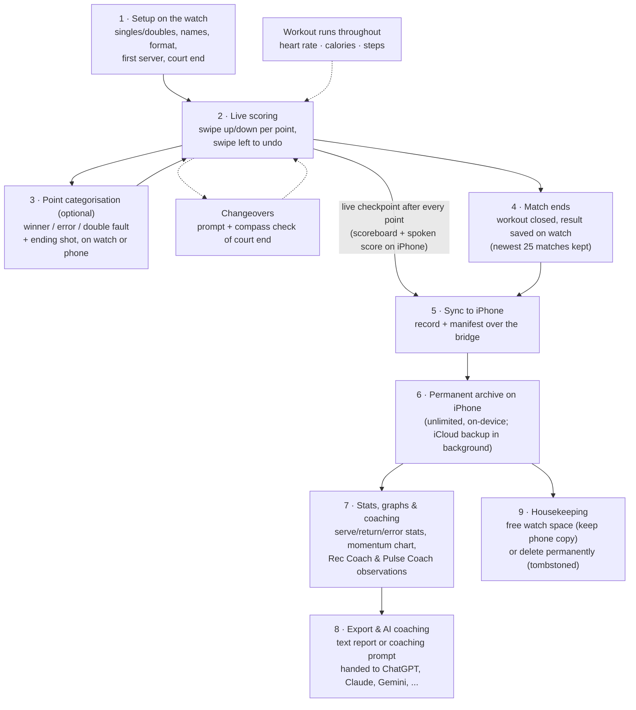

# Match Lifecycle — the journey of one tennis match

This is the end-to-end story of a single match, from the first swipe to an AI
coaching conversation, with the responsible files named at each stage (each is
described in the [file inventory](file-inventory.md)).

## Stage by stage

**1 · Setup (watch).** The player picks singles or doubles, names, the match
format (six supported, from best-of-3 to perpetual tiebreak — the rules are
data-driven in `ScoreTypes`), who serves first, and confirms the court end if the
compass feature is on. A HealthKit workout session starts automatically with the
match (given HealthKit permission).
*Files: `HomeView`, `ScoreViewModel`, `WorkoutManager`.*

**2 · Live scoring (watch).** Each swipe becomes "player X won a point" and is fed
through the shared tennis rulebook (`ScoringEngine`), which returns the new score
plus events: game won, set won, tiebreak started, changeover due. Undo rolls the
whole game state back. After every point the watch saves a checkpoint locally
(crash-safe: the match can be resumed) and sends it to the phone, which updates
the live scoreboard and — if enabled and on screen — speaks the score.
*Files: `ContentView`, `ScoreViewModel`, `ScoringEngine`, `StatsStore`,
`WatchMatchSyncService` → `PhoneMatchSyncService`, `LiveScoreboardView`,
`LiveAnnouncementService`.*

**3 · Point categorisation (optional, watch or phone).** With outcome tracking on,
a sheet asks how the point ended (winner, forced error, unforced error, double
fault) and on which shot. The same pending point is mirrored to the phone so a
spectator can tag it instead. Each tagged point also snapshots the player's heart
rate and step count — the raw material for all statistics and coaching.
*Files: `PointCategorySheet` (watch), `LivePointCategoryPanel` (phone),
`PointStat` (the data).*

**Throughout: workout & changeovers.** The workout session collects heart rate,
calories, steps and distance; at changeovers the watch prompts the players and can
use the compass to confirm they're heading to the correct end.
*Files: `WorkoutManager`, `ScoreViewModel`, `ContentView`.*

**4 · Match end (watch).** The final point completes the match; the workout is
closed and its totals attached; the finished record is saved on the watch. The
watch keeps only its newest 25 matches — older ones roll off (the phone keeps
them; see stage 6). *Files: `ScoreViewModel`, `WorkoutManager`, `StatsStore`,
`WatchHistoryCap`.*

**5 · Sync (watch → phone).** The finished record, an "active match over" signal
and the watch's manifest (which match IDs it still holds) go to the phone. The
merge rules (`MatchMergePolicy`) guarantee a finished match can never be
overwritten by stale data, and deleted matches stay deleted (tombstones). Details
in [sync-and-data-flow.md](sync-and-data-flow.md).
*Files: `WatchMatchSyncService`, `PhoneMatchSyncService`, `MatchMergePolicy`,
`MatchSyncTransport`.*

**6 · Archive (phone).** The match joins the permanent archive — a JSON pair
stored on-device (always readable at launch) with a background backup in the
user's own iCloud Drive (status shown as "Backed up to iCloud"). iCloud can
restore during initial local archive setup; after that it receives pushes from
the phone and does not merge back. Backup rules live in `ArchiveBackupPolicy`.
The list shows where each match lives: both devices, phone only, or watch only.
*Files: `PastMatchesView`, `PhoneStatsStore`, `ArchiveBackupPolicy`,
`ICloudBackupCopy`, `MatchStorageLocation`, `WatchMirror`.*

**7 · Stats, graphs & coaching (phone).** The match page derives everything from
the tagged points: serve/return/break-point stats, error profile, pressure-point
performance (`MatchStatsSummary`); a momentum chart with optional heart-rate and
step overlays fetched from HealthKit; "Rec Coach" observations (from at least 20
tagged points) and "Pulse Coach" heart-rate observations (from at least 10
HR-tagged points). *Files: `MatchDetailView`, `PointsGraphView`,
`HealthKitHRFetcher`, `MatchStatsSummary`, `RecCoachInsights`/`RecCoachSection`,
`PulseCoachInsights`/`PulseCoachSection`.*

**8 · Export & AI coaching (phone).** The player can export a text summary, a full
point-by-point report, or an AI coaching prompt tuned to their skill level, and
hand it straight to an installed AI chat app (ChatGPT, Claude, Gemini, Perplexity,
Copilot, Poe, Grok) or the share sheet. *Files: `MatchExporter`, `AICoachSheet`,
`AICoachLauncher`.*

**9 · Housekeeping.** From the phone the user can free up watch space (delete from
the watch, keep the archive copy — the badge flips to "phone only") or delete a
match permanently (tombstoned so no future sync resurrects it). A watch-only match
can be pulled back into the phone archive at any time.
*Files: `PastMatchesView`, `PhoneStatsStore`, `PhoneMatchSyncService`.*

## Side journey: manual match entry (phone → watch)

The one case where a match starts on the phone: reconstructing a match from a
paper scorecard or after a watch mishap. The form builds the match record, saves
it **directly into the phone archive**, and sends a copy to the watch — after
which the watch owns the live match and it can be resumed and scored normally.
This is the single deliberate exception to "the phone never authors match data."
*Files: `ManualMatchEntryView` → `PhoneMatchSyncService` → `WatchMatchSyncService`
→ `ScoreViewModel`.*
