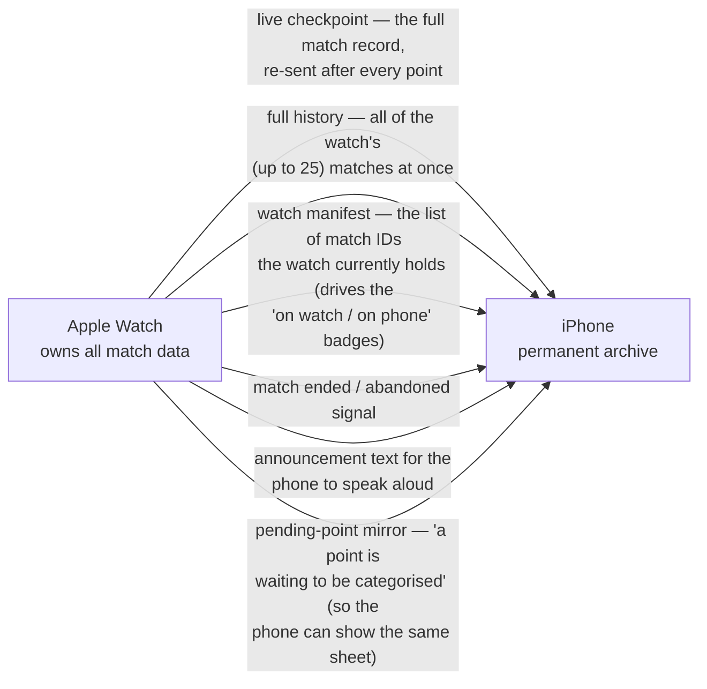
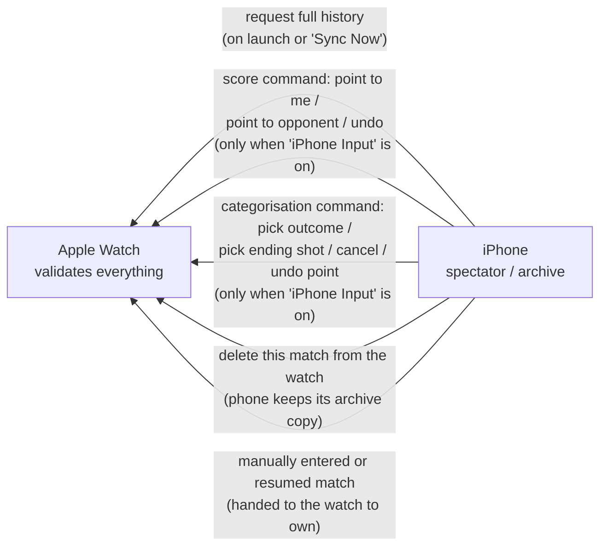
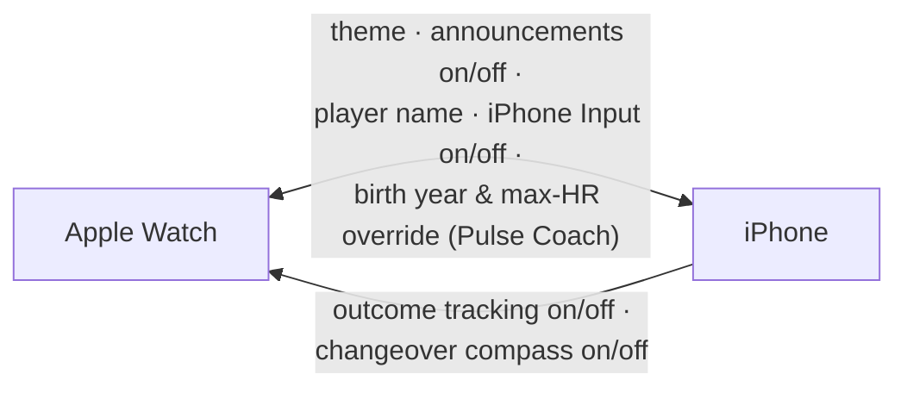
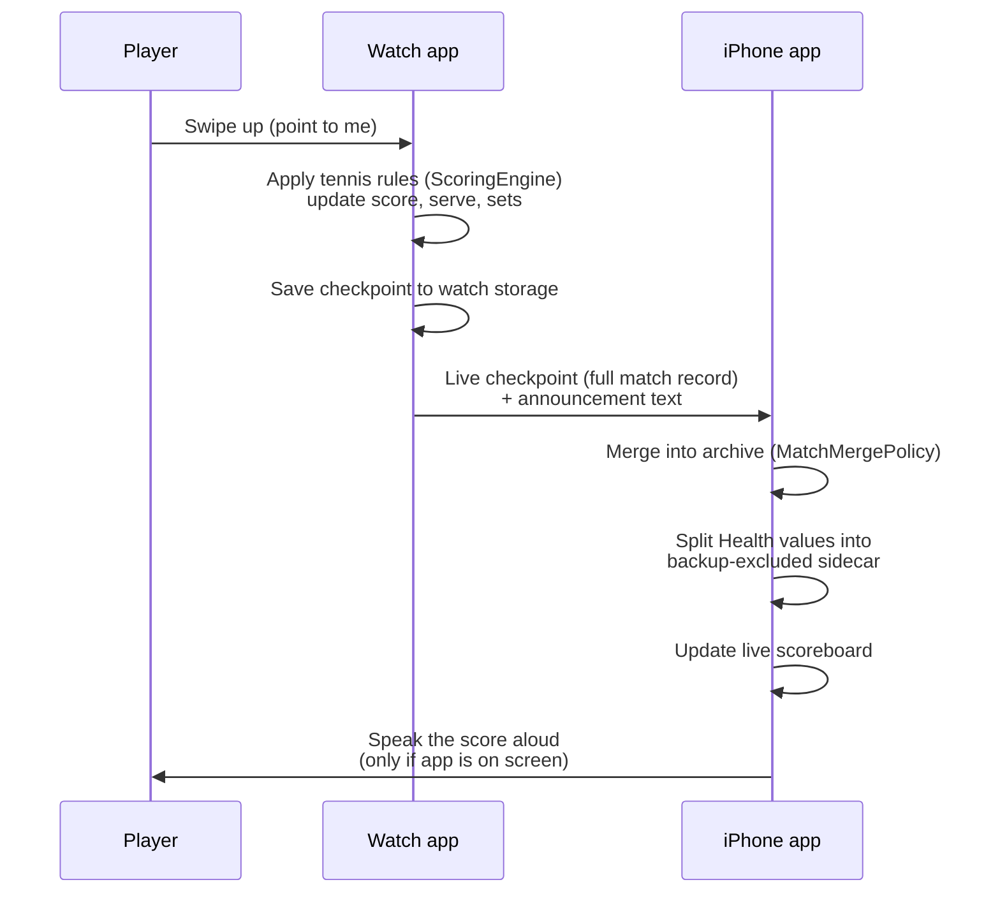
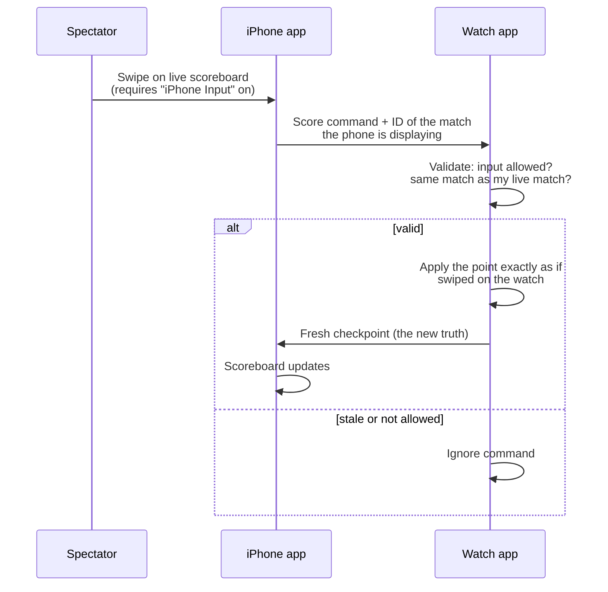

# Sync & Data Flow — what travels between the watch and the phone

Everything between the two apps crosses **WatchConnectivity**, Apple's
watch-to-phone bridge. Each side has one "sync service" file
(`WatchMatchSyncService` on the watch, `PhoneMatchSyncService` on the phone);
the message vocabulary, encoding and merge rules live in the shared package so
both sides are guaranteed to speak the same dialect
(`MatchSyncMessage`, `MatchSyncPayloadBuilder`, `SyncIncomingPayload`,
`MatchSyncTransport`, `MatchMergePolicy`).

The golden rule from the [topology map](README.md): **match data flows watch → phone;
the phone only sends requests and commands back, which the watch validates.**

## 1. Match data — one way, watch → phone

Delivery is pragmatic: live checkpoints go instantly when the phone is reachable
(and are silently skipped when it isn't — the next checkpoint supersedes them);
important records are queued so they survive locked screens; large history pushes
go as file transfers. That strategy lives in `MatchSyncTransport`. A successfully
read full-history request ends with the Watch manifest; an unreadable Watch
archive sends neither history nor a misleading empty manifest. The phone treats
a received manifest as the successful acknowledgement even when it is empty,
because the transport intentionally sends no history file for an empty Watch
archive. The Sync Now result shows both device counts; if the iPhone has archived
matches and a fresh Watch has none, it directs the user to open a match and choose
**Sync to Watch** to restore selected records. Watch pairing/installation changes
are refreshed through `sessionWatchStateDidChange`, rather than remaining frozen
at activation.

## 2. Requests & commands — phone → watch, watch decides

Two safety properties worth knowing as a reviewer:

- **Score commands carry the match ID the phone was displaying.** The watch
  rejects any command whose ID doesn't match its current live match, so a stale
  phone can never score points into a later, unrelated match.
- **All of this is gated by the "iPhone Input" setting.** Off by default; with it
  off, the phone is strictly read-only for the live match.

## 3. Settings — synced, last-write-wins

Most settings travel both ways and the most recent change wins. Two are
watch-behaviour switches sent phone → watch only. (A third wire key,
`workoutSessionEnabled`, exists in the vocabulary but is currently **dead**:
nothing sends it and both receivers deliberately ignore it — the workout always
runs with a match. A future PR claiming to add a workout toggle must wire that
key end-to-end, not merely flip a value.) One caution flagged in
`CLAUDE.md`: each setting's name exists as a plain text string in two or three
places that the compiler doesn't connect (the wire key, the watch's storage, the
phone's storage) — so a PR that touches a synced setting should show the same
key string updated everywhere, or it will *look* fine and silently fail to sync.

## 4. Two conversations, step by step

**A point is scored on the watch** (the everyday flow):

**A spectator scores from the phone** (the gated flow):

Note the shape of the second flow: the phone never updates its own scoreboard
from the swipe — it waits for the watch's checkpoint to come back. The watch's
record is always the truth.

## 5. Merging, deleting, and why deleted matches stay deleted

When a match record arrives on the phone, `MatchMergePolicy` decides what to keep:

1. **Never seen this match before** → store it.
2. **Incoming is finished, stored copy was in-progress** → the finished one wins.
3. **Incoming is in-progress, stored copy is finished** → keep the finished one
   (a late-arriving live checkpoint can never "un-finish" a match).
4. **Both finished** → keep the one that ended later.
5. **Both in-progress** → always accept the incoming one — the watch is the live
   source of truth (this also makes undo work: the reverted state replaces the
   old one even though it has fewer points).

**Tombstones:** when the user permanently deletes a match on the phone, its ID is
remembered in a small "tombstones" list. Any future sync from the watch skips
tombstoned IDs — so a deleted match can never be resurrected by the next history
push. Deleting from the *watch only* ("free up watch space") is different: the
phone keeps its copy and just updates the match's location badge.

**Location badges:** the watch periodically reports the list of match IDs it
holds (the *manifest*). Comparing that list with the phone's archive
(`MatchStorageLocation`) yields each match's badge: on **both** devices, on the
**phone only** (rolled off the watch's 25-match cap, or removed to free space), or
on the **watch only** (deleted from the phone, still visible via the phone's
mirror of the watch — `WatchMirror`).

## 6. Manual archive export / import (iPhone Settings → Backup & Transfer)

Separate from both watch→phone sync (§1) and the one-way iCloud backup, the
iPhone exposes a user-driven **archive file** round-trip in
Settings → Backup & Transfer. The file format and the import rules are pure logic in
`ManualMatchArchiveBackup` (Core); the view (`SettingsView`) only drives the
document picker and the confirmation dialogs, persisting through
`PhoneStatsStore.importManualArchive`.

> The manual archive is one of several health-bearing surfaces gated by a
> per-export consent disclosure. For the full picture of where HealthKit data is
> stripped, excluded, or gated across the whole app, see
> [health-data-flow.md](health-data-flow.md).

- **Export Match Archive** writes a versioned JSON document
  (`format: "deucemate.matchArchive"`, `schemaVersion: 1`) of the phone's
  records, newest-first. Unlike the iCloud backup snapshot — which strips the
  five HealthKit-derived fields to comply with App Store Review Guideline
  5.1.3(ii) — a manual export is **full-fidelity**: it keeps heart rate, steps,
  distance, and calories. That is why the two codecs are deliberately kept
  separate (`ManualMatchArchiveBackup` vs `ArchiveBackupPolicy`).
- **Import Match Archive** first decodes and validates the file (wrong format or
  an unsupported schema version is rejected with a clear error) and shows a
  preview — record count, whether health data is included, and the export date.
  The user then picks one of two modes:

  - **Merge** — union by match id. Records new to the phone are added; for an id
    already present, the same `MatchMergePolicy.resolve` rules from §5 pick the
    winner (finished beats in-progress, the newer finish wins, etc.). Then any
    `nil` HealthKit-derived fields on the kept record are **backfilled** from the
    imported copy (`MatchRecord.fillingMissingHealthData`) — so a merge never
    loses recorded health data even when the existing record is the one kept.
  - **Replace** — the phone archive becomes exactly the imported records;
    matches currently on the phone but absent from the file are dropped. The UI
    guards this behind a second, destructive confirmation. Dropped records are
    **not** tombstoned (unlike a phone-side delete, §5), so a dropped match that
    still lives on the paired watch reappears on the next watch→phone sync —
    Replace makes the *iPhone* archive equal to the file, not the whole
    watch + phone system.

- **Both modes un-delete:** any imported id that was previously tombstoned has
  its tombstone removed (`tombstones.subtracting(incomingIDs)`), so importing a
  match you had deleted brings it back. The result is always sorted newest-first.

This flow only ever writes the **phone** archive (via the same `adoptOnQueue`
funnel as any other mutation): it does **not** push to the watch, and the watch
stays the source of truth for live matches (§1). Because it goes through the
normal funnel, full records remain in memory while `HealthSidecarPolicy` writes
a health-stripped `matchHistory.json` and a backup-excluded Health sidecar. The
stripped result is subsequently pushed to the iCloud backup on the usual
debounced schedule — so a Replace also overwrites the previous iCloud backup
once it lands. A full-fidelity manual import can repopulate missing sidecar data
after an automatic restore.
