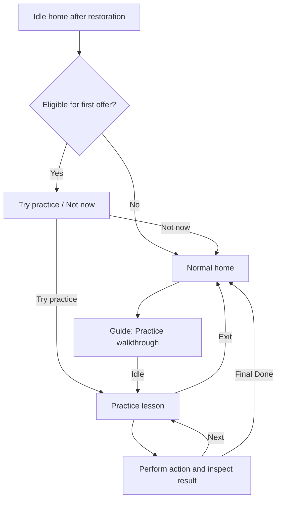

# Plan: First-Time Watch Walkthrough

**Status:** Proposed; documentation only, no implementation started.
**Requested:** 18 September 2026.
**Classification:** New onboarding feature / product enhancement.
**Recommendation:** An optional, interactive practice session on Apple Watch,
lasting roughly 3–4 minutes, with individual lessons available to replay.

**Scope:** Teach server rotation with a single game-winning point at 40–0,
then compare odd/even set endings. The detailed tiebreak chapter is retained
in Appendix A as optional advanced practice for a follow-up release; it is
not part of the first-time flow or a prerequisite for shipping it.

## 1. Outcome and scope

A new user should be able to score and undo points, record an unforced error
and find it in live stats, identify the next server and service side, and
understand the changeover popup and persistent set-end reminder before
starting a real match.

The walkthrough uses a clearly labelled practice scoreboard and scripted
examples. Its points never become an archived match, workout, phone live
score, or trend sample. It works offline without a paired iPhone.

The first release teaches **Singles / Best of 3 (Club/League)** using regular
games and a first-set finish followed by set two. Tiebreaks, doubles rotation,
and second-serve tracking are optional follow-on lessons. Keep the core
explanation focused on the controls and reminders needed to begin playing.
This feature does not require a walkthrough for every format, an iPhone
interactive tutorial, a website change, or a new scoring implementation.

## 2. What exists already

These are current implementation facts, checked on 18 September 2026:

| Existing surface | Coverage | Remaining gap |
|---|---|---|
| Watch `HomeView` → Guide | Text explaining four swipes, double-tap, indicators, and tricky rules | Reading only; no guided practice or completion state |
| Watch `ContentView` | First-game `↑ Win ↓ Lose / ← Undo → Stats` hint, gesture preview and point flash | No explanation of categorisation, stats attribution, serving side, or reminders |
| `MATCH_START_UX_PLAN.md`; debt #5, completed | Remembered match setup and tracking-status strip | Faster setup is separate from learning the controls |
| `INTERACTIVE_DEMO_PARITY_PLAN.md`, shipped | Browser demo with scoring and stats | A marketing demo, not native first-use onboarding |
| `ENDS_SWITCH_REMINDER_PLAN.md`, implemented | Set-boundary banner survives tapping OK | Its meaning and lifetime are not demonstrated interactively |

Keep the existing Guide as a quick reference. Add **Practice walkthrough**
at its top. Do not reopen completed debt #5 or describe this feature as
already delivered by that item.

## 3. Entry, exit, and first-use behaviour

- Offer one compact **Learn the controls** sheet when the watch first reaches
  an idle home screen after state restoration: **Try practice** / **Not now**.
  Keep the normal Start Match path unchanged after dismissal.
- Wait for existing launch/Health authorization presentation to finish before
  presenting this offer. Permission denial must not block practice. The
  walkthrough itself requests no permissions.
- Do not offer or launch practice while a real match, warm-up, pending point,
  or setup sheet is active. Guide remains readable; its practice entry explains
  that practice is available when the current match/setup has ended. Never
  reset, pause, or finish a real match to make room for a lesson.
- Determine automatic-offer eligibility only after successful state/history
  reads. An unreadable store is not proof that this is a first-time user.
  Existing users with match history get the replay entry without an automatic
  prompt. Users with no history may receive the one-time offer after upgrading.
- **Not now** and interactive dismissal suppress automatic re-presentation.
  Reopening from Guide always works when idle. Completion also suppresses it.
- Every lesson provides **Exit practice**, **Replay lesson**, and an explicit
  **Next** action after success; a chapter list permits skipping a lesson.
  Exiting or a process restart discards practice state. Replay starts the
  chosen lesson from its fixture; no unfinished real match is created.
- Use separate watch-local keys, provisionally `walkthroughOfferSeenVersion`
  and `walkthroughCompletedVersion`. Do not reuse `hasCompletedFirstGame`:
  it drives the existing in-match hint and is not an onboarding marker.
  Only reaching the final Done screen records completion; skipping/exiting
  records offer-seen only. A content-version bump does not force a repeat
  offer for existing users; new lessons remain discoverable through Guide.

## 4. Core lessons

Keep a **Practice** label visible. Each lesson has one short instruction,
the familiar app control, and a brief explanation of the result. Users
advance explicitly so a successful gesture does not hide the score change.
Use **left / Undo**, not “back”: left on the live scoreboard changes the
score; it is not page navigation.

| Lesson | Starting example and user action | Visible result / lesson learned |
|---|---|---|
| 1. Win a point | Singles, 0–0, Me serving. “You won the rally. Swipe up.” | Me becomes 15–0; the same row preview and point feedback as live scoring. The server remains Me; the service side changes from right/deuce to left/ad. |
| 2. Lose a point | Continue from 15–0. “Your opponent won. Swipe down.” | 15–15. The gesture awards the opponent a point regardless of who served. |
| 3. Correct a mistake | “That last point was a mistake. Swipe left to undo it.” | Return to 15–0, including the previous server/side state. Explain that undo also restores game/set boundaries and tracked stats. |
| 4. Record your unforced error | Clearly reset to a new 0–0 example, with **Practice point tracking: On**. “You hit a routine rally ball out. Swipe down.” Then choose **Unforced Error**, followed by **Rally**. | 0–15; one completed `PointStat`, attributed to Me as the losing player. Explain that the app learns the cause from the user's selection, not from the swipe or sensors. |
| 5. Find that stat | After the categorisation sheet closes: “Swipe right for live stats.” | Open the familiar stats content; locate **Unforced Errors**, **Me: 1 / Opp: 0**. Teach scrolling with the Crown and looking under Errors. Dismiss stats with an explicit close/back control, not a left-scoring gesture. |
| 6. Win a game; the server changes | Load **Example: Me leads 1–0 in games, Me serving at 40–0**. Highlight Me's ball badge; swipe up once. | Me wins the game for **2–0**. The game points reset to 0–0, the ball badge moves to **Opp**, and Opp serves from their right/deuce side. Acknowledge **Even games – balls change ends**: players stay at their ends and get the balls to Opp. |
| 7. Finish a set: change ends | Load **Example: first set, Me leads 5–3, Me serving at 40–0**. Swipe up once to finish **6–3**. | Nine games is odd: **Set complete – players change ends**. Opp serves next. After OK, **Players change ends** remains below the score until the first point of set two; score that point to see it clear. |
| 8. Finish a set: stay at your end | Load **Example: first set, Me leads 5–2, Me serving at 40–0**. Swipe up once to finish **6–2**. | Eight games is even: **Set complete – balls change ends**. Players stay at their ends; Opp serves next. After OK, the sticky **Balls change ends** reminder clears on set two's first point. Explain that the next player end change is after the first game of set two. |

For lessons 1–3 and 6–8, practice outcome prompts are off so the user can focus
on the gesture/reminder. Announce the practice-only tracking change at lesson
4, and explain before lesson 6 that the examples now skip categorisation.
The real `statsTrackingEnabled` preference never changes. The final screen
reminds the user to enable **Track point outcome** before a real match to get
error statistics; offer **Open Settings**, with no automatic toggle.

Later-score examples must visibly say **Example: later in a match** before
loading the fixture. Do not make the user score an entire set or silently
jump from 15–0 to 5–3. Lessons 6–8 are separate, labelled examples, each
with Me deliberately set as the current server; they are not a continuous
match and need not have the same opening server.

The **1–0 → 2–0** fixture is deliberate: it changes the server while players
stay at their ends, so the learner can distinguish a server change from an
end change. At 40–0 Me serves from the left/ad side (three points played);
the new game starts with Opp on their right/deuce side. Lessons 1–3 have
already demonstrated that service side alternates between points.

Use the same three-part feedback in each of lessons 6–8: **Score → Next
server → Change ends or stay**. The two set finishes then teach the odd/even
rule without introducing a different scoring system. After lesson 8, show
**Done / Ready to play**; do not automatically continue into advanced rules.
The earlier tiebreak work remains in Appendix A for **Guide → Tiebreaks and
the next set** when that optional chapter ships.

Wrong-direction input produces a brief hint and does not advance the lesson.
Keep **Show me** available as a static or animated demonstration and provide
a labelled action equivalent for users who cannot perform the gesture.
No timers, penalties, or requirement to complete every lesson before playing.

## 5. Serving, court position, and reminder semantics

Teach three separate things explicitly:

1. **Who serves next:** the tennis-ball badge identifies the next server;
   it does not identify the winner of the previous point. In regular singles
   games, the same player serves throughout the game; the server changes
   after the game.
2. **Which service side:** start a regular game on the server's right/deuce
   side, then alternate left/ad and right/deuce after each point. The court
   diagram keeps Me at the bottom and Opp at the top. Opponent's right is
   therefore screen-left. Show the highlighted positions and text together.
3. **Which end of the court:** the changeover popup answers whether players
   move to the opposite ends. The diagram is a relative schematic; without
   the optional calibrated Changeover Compass it is not a physical compass.

In this app, **Balls change ends** describes ball movement, not replacing
balls with new ones. When it appears alone, players stay put and get the
balls to the next server. When **players & balls** move after six tiebreak
points, the same server takes the balls to the other end to finish their
two-point turn. That distinction belongs to the optional Appendix A lesson;
the core flow only needs the regular-game and set-end examples above.

Use Core's actual `ScoringChangeover` events and
`ScoringEngine.nextSetRequiresEndsSwitch` for the examples. Ordinary
changeover popups do not depend on the optional Changeover Compass setting.
The sticky banner is specifically for a new regular set awaiting its first
point; do not promise it during every game changeover, at match completion,
or before a deciding super-tiebreak.

### Optional follow-on lessons

- **Tiebreaks and the next set:** Appendix A retains the full entry, sixth-point
  changeover, and 7–4 / 7–5 / 8–6 ending examples. Offer it from Guide as
  separate advanced practice in a follow-up release.
- **Second serve:** double-tap the score card, inspect the yellow 2 badge,
  then lose a practice service point and select Double Fault. Explain why
  Double Fault is only offered when the server loses on a marked second serve.
- **Doubles:** show a valid order **Me → Opp S1 → Partner → Opp S2** and the
  existing next-server choice when the engine requests it. Label team stats
  **Our**, rather than implying that errors identify one partner individually.

These are independently replayable chapters after the core walkthrough.
They do not delay a first real match and may ship in a follow-up PR.

## 6. Implementation approach

The main work is separating reusable display/interaction code from the live
match's side effects. Simply constructing another `ScoreViewModel` is not
safe: it owns `WorkoutManager`, writes settings/state, and participates in
sync. `PointCategorySheet` and `MatchStatsView` also currently obtain it via
`@EnvironmentObject`.

| Area | Proposed implementation |
|---|---|
| Portable lesson state | New Core `Walkthrough/WalkthroughSession.swift`: lesson identifiers, fixtures, expected actions, scoring state, practice-only undo snapshots, pending categorisation and points. Apply `ScoringEngine.pointWon`; compute statistics with `MatchStatsSummary`. No persistence, sync, or sensor dependencies. |
| Fixtures | New Core `Walkthrough/WalkthroughFixtures.swift`: deterministic, valid pre-point states for the core examples. Include format, server, game count, and pre-point snapshots; verify the 40–0 game win and the 6–3 / 6–2 set finishes. Tiebreak rotation and fixed-landmark end history are added with the optional advanced chapter. |
| Watch presentation | New watch `Walkthrough/WalkthroughView.swift` and a small observable adapter. Drive overlays and lesson progression from the portable session; handle permitted local haptics here. A new view model must not register for live remote score commands. |
| Shared gestures | Extract the existing watch drag-to-action mapping into a small pure helper used by both live and practice input. Preserve current direction thresholds, stronger right-swipe threshold, and production blocking guards. Lesson progression adds its own expected-action check. |
| Shared visuals | Extract only the score/court, point-category controls, stats content, and changeover presentation needed by both flows into value-and-callback views. Keep production wrappers wired to the existing `ScoreViewModel`. Do not copy the screens or broaden this into a full view-model refactor. |
| Entry and local flags | `HomeView` hosts the offer and Guide entry; explicit launch readiness comes from the existing restoration/authorization flow in `DeuceMateApp`. First-use decisions need success/failure information, not an empty-array fallback. |

The pure session captures the **pre-point** server, score, and second-serve
context before reducing a point. Categorisation commits one point; undo
restores score, point count, server, pending state, and stats together. Pending
categorisation takes precedence over queued changeover presentation, matching
the live flow. Replay/exit cancels delayed selection or presentation callbacks
so they cannot mutate the next lesson.

The first release reuses the existing relative court diagram and changeover
reminders. The fixed-landmark end illustration and its extra state belong to
the optional tiebreak chapter; do not make that work a core-flow dependency.

Share existing category-selection rules where practical; debt #12 already
tracks their wider extraction across watch and phone. This feature must not
create a third independent categorisation algorithm or require all of #12
to be completed first. Preserve live behaviour through small callback-based
extractions and targeted tests.

### Isolation contract

- Practice must never call `ScoreViewModel.winPoint`, `resetMatch`,
  `resumeMatch`, `saveState`, or the production store/sync APIs.
- No practice `MatchRecord` is written, synced, exported, announced on the
  phone, or offered as resumable. Avoid creating one when a scoring snapshot
  and point array are sufficient.
- Do not start/stop a workout, acquire heading, calibrate the compass, or
  request Health/location access for a lesson. Existing app-launch behaviour
  is separate; do not claim that first app launch has no permission prompt.
- Read the current theme; change only the two walkthrough flags. Do not
  modify remembered match setup, tracking, announcements, input, or hint keys.
- Background/foreground and remote messages remain owned by the production
  app. Disposing the practice session must not send `clearActiveMatch` or
  cancel production work.

## 7. Accessibility and watch layout

- No horizontal paging: left/right are the controls being taught. Use labelled
  Previous/Next buttons or the chapter list for tutorial navigation, separate
  from the scoreboard gesture area. Never attach scoring drags to instructions
  that need scrolling, stats sheets, or navigation controls.
- Use one compact instruction at a time and a real watch-size scoreboard.
  Measure on the smallest supported watch as well as a larger model; do not
  squeeze the existing set-end reminder to make space for prose. Longer
  explanations can use a separate card before or after the exercise.
- VoiceOver announces the expected action and resulting score/next server.
  Named actions and buttons reach the same lesson transitions. Coordinate
  production equivalents with debt #24 so the learned accessible action is
  also available during real scoring.
- Honour Reduce Motion; text and static arrows must convey everything that
  animations or haptics convey. Gesture practice is never a mandatory gate.

## 8. Verification and acceptance

The three 40–0 fixtures below were checked against the existing Core reducer
with a standalone Swift runner on 18 September 2026. The resulting scores,
next server, changeover events, and first-new-set-point reminder clearing
were confirmed. Walkthrough UI and interaction tests remain implementation work.

**Core tests:** all scripted transitions, wrong-action handling, undo/replay,
UE attribution, server/side parity, and reminder lifetime. Specifically:

- From Me serving at 40–0 and leading 1–0 in games, a Me win produces 2–0,
  resets game points to 0–0, selects Opp as next server, and emits
  `evenGames` (balls move; players stay). No new-set banner appears.
- From Me serving at 40–0 and leading 5–3 in set one, a Me win finishes
  6–3, selects Opp for set two, emits `setCompletePlayers`, and leaves a
  sticky player-change reminder after acknowledgement.
- From the separate 5–2 / 40–0 fixture with Me serving, a Me win finishes
  6–2, selects Opp for set two, emits `setCompleteBalls`, and leaves a
  sticky balls-only reminder after acknowledgement.
- In both set examples, the first new-set point clears the sticky reminder.
  Undo/replay restores the score, server, and reminder consistently.

Keep existing match-complete and deciding-super-tiebreak suppression guards
intact; teaching those cases is not required for core-flow completion.
Advanced chapter fixture checks are listed in Appendix A and become delivery
requirements when that chapter is implemented.

**Watch integration tests:** prove that first-use flags, restore outcomes,
skip/completion, active-match guards, modal sequencing, and cancelled delayed
callbacks behave correctly. Assert production stores, match state, settings,
sync, workout, and heading dependencies receive no practice mutations.
The app may perform its normal launch bookkeeping; compare against that
baseline rather than asserting that the whole running app never writes.

**Device/simulator acceptance:** a fresh user can perform up/down/left/right,
record and find Me: 1 unforced error, explain who serves next and from which
side, and identify Opp as next server after the 40–0 game-winning point.
They can distinguish the 6–3 player-change reminder from the 6–2 stay-at-your-end
case after tapping OK. Completing the walkthrough requires no tiebreak
exercise or knowledge of tiebreak service order.
Repeat with VoiceOver, Reduce Motion, tracking off in real settings, denied
Health access, no reachable iPhone, background/return, and early exit. Existing
live scoring, categorisation, undo, and reminders must remain unchanged.

Run relevant Core and Watch suites locally with available Swift/Xcode,
plus iPhone tests if shared code changes. No GitHub Actions verification.
Evaluate comprehension with a short observed first-use session; no analytics
or external data collection is needed.

## 9. Delivery and effort

| Increment | Deliverable | Indicative effort |
|---|---|---|
| 1 | Portable practice session/fixtures, narrow shared UI/input extractions, regression tests | 2–3 engineering days |
| 2 | Eight core lessons, Guide/first-use entry, local flags, accessibility and lifecycle handling | 2–3 days |
| 3 | Small-watch/device verification, comprehension pass, documentation and polish | 1–2 days |
| Follow-up A | Optional tiebreak chapter and fixed-end illustration | 1–2 additional days |
| Follow-up B | Optional second-serve and doubles chapters | 1–2 additional days |

Allow **roughly 5–8 engineering days for the core walkthrough**, subject to
the component-extraction and device checks. Advanced chapters are separately
estimated and do not block the first release. This is a medium feature, not a
few help-text additions. A shorter static tour is cheaper but does not prove
the user can perform the gestures or find their recorded error.

Ship focused PRs in that order; keep the tutorial entry out of the shipped
UI until the core flow is complete. The four review improvements are tracked
separately in `TECHNICAL_DEBT.md` #22–25. Accessibility #24 overlaps shared
input work; phone disconnect feedback, manual entry, and export retry are not
walkthrough prerequisites. Persistence #18 remains its own priority.

When implementing, update `docs/architecture/file-inventory.md` for new or
repurposed production files, add the isolated practice branch to the match
lifecycle diagram, update `CLAUDE.md` with file locations and the new local-key
exceptions, and add the shipped entry path to `docs/USER_GUIDE.md`. This
planning-only change does not alter the architecture inventory or user guide.

## 10. Related plans

- [Technical debt and improvement backlog](TECHNICAL_DEBT.md) — #5 completed;
  #12 categorisation reuse; #18 persistence containment; #22–25 review items.
- [Match start UX](MATCH_START_UX_PLAN.md) — preserve the remembered setup and
  fast start path.
- [Sticky ends-switch reminder](ENDS_SWITCH_REMINDER_PLAN.md) — actual banner
  meaning, lifetime, and layout constraints.
- [Changeover Compass](CHECK_CHANGEOVER_PLAN.md) — distinguish relative court
  side from calibrated physical direction.
- [Browser demo parity](INTERACTIVE_DEMO_PARITY_PLAN.md) — related prior work;
  no browser demo change is required for this native feature.

## Appendix A. Optional advanced practice: tiebreaks and the next set

**Status:** Retained design for a follow-up release, accessible from Guide.
Outside the first-time flow and its completion/acceptance criteria. Allow
roughly two additional minutes when the user explicitly chooses this chapter.
The fixed-landmark illustration is also follow-up scope.

| Step | Starting example and user action | Visible result / lesson learned |
|---|---|---|
| T1. Enter a tiebreak | First set, Me leads 6–5; Opp is serving at 40–0. Swipe down so Opp holds for 6–6. | **Games at 6–6 – tiebreak begins**. Me is next in service order and starts the tiebreak. No end change at 6–6. Introduce fixed example End A / End B labels. |
| T2. Serve one, then two | Start the tiebreak with Me serving point 1; step through points 2–3 by Opp and 4–5 by Me. | The next-server badge follows the service order, independent of point winner. Show right/deuce for point 1, left/ad then right/deuce for each two-point turn. |
| T3. The sixth point | Continue the scripted score from 3–2 to 3–3: Opp serves point 6 and wins it. Acknowledge **Every 6 tiebreak points – players & balls change ends**. | Both players move; Opp takes the balls and **still serves point 7**, now from the other end and their right/deuce side. Moving ends does not finish Opp's two-point service turn. |
| T4. End the tiebreak, start the next set | Continue to Me leading 6–4; Opp serves point 11 and Me wins for **7–4 in the tiebreak / 7–6 in games**. | Show **Set complete – players & balls change ends**, then sticky **Players change ends** after OK. Both players swap from their current ends. **Opp serves set two**, because Opp received the first tiebreak point. Show the first new-set point clearing the reminder. |
| T5. Finish exactly on a six-point boundary | A short alternative ending: Me leads 6–5 in the tiebreak; Me serves point 12 and wins for 7–5. | Show **one** set-end changeover, **Players change ends**, and Opp serving set two. Do not show two successive swaps for “point 12” and “set over”. |

**Rule basis:** Use the standard tiebreak procedure in
[2026 ITF Rules of Tennis](https://www.itftennis.com/media/7221/2026-rules-of-tennis-english.pdf),
rules 5(b), 6(b), 10, and 17 (printed pages 5–8; checked 18 September 2026).
The next player in service order starts with one point, followed by
alternating two-point turns. End changes occur after each six points. The
first receiver serves the following set; a 7–6 set has an odd game total,
so players change ends when it finishes. Service side alternates per point.
These examples use the app's standard six-point changeover, not an
alternative tournament procedure.

**Distinguish the counters:** show **Games: 6–6** and **Tiebreak: 3–3** with
different labels. “Sixth point” means six points combined, not either player
reaching six. The finished example is **Set: 7–6 (tiebreak 7–4)**.

**Physical-end illustration:** give the practice court fixed landmarks:
**End A — clubhouse** and **End B — fence**. Me begins the tiebreak at A;
Opp begins at B. These are fictional teaching labels, not sensed locations.
Keep that little diagram fixed while player and ball markers move; show it
on an explanatory card, rather than changing `CourtSideView`'s established
Me-bottom/Opp-top orientation. Accompany every move with text so remembering
colours, an animation, or the starting picture is unnecessary.

#### Primary example: Me wins the tiebreak 7–4

Begin with the last point of game twelve, as in step T1. The following
point winners provide a continuous, valid tiebreak:
**Me, Opp, Me, Opp, Me, Opp, Me, Opp, Me, Me, Me**.
Users can play it through or use explicit **Jump to the next example**
checkpoints, each restoring the correct server, score, and physical ends.

| Moment | Serve and score | Where the players/balls go |
|---|---|---|
| Opp holds from 6–5 to 6–6 | Opp served game twelve; Me is due next. Me starts the tiebreak on the right/deuce side. | Stay at the current ends: Me at A, Opp at B. Get the balls to Me. Reaching 6–6 is not an end change. |
| Points 1–5 | Servers: **Me; Opp, Opp; Me, Me**. The scripted score reaches 3–2. | Both stay at their starting ends. At each server change, the balls go to that server. |
| Point 6, reaching 3–3 | Opp serves from the left/ad side and wins. Opp has used only the first point of their two-point turn. | **Players & balls change ends:** Me goes A → B; Opp takes the balls B → A. |
| Point 7, reaching 4–3 | **Opp serves again**, from the right/deuce side at A; Me wins the return point. | After this point, the balls go to Me for points 8–9. Players do not change ends again. |
| Points 8–10, reaching 6–4 | Me serves points 8–9; Opp serves point 10. | Players remain Me at B / Opp at A. |
| Point 11, finishing 7–4 | **Opp serves point 11**; Me wins the return point. The set finishes 7–6. | **Players & balls change ends:** Me goes B → A; Opp takes the balls A → B. |
| Set two, 0–0 | **Opp serves** from the right/deuce side at B; Me receives at A. Opp was the first receiver in the tiebreak. | After OK, **Players change ends** stays visible until the first new-set point. It describes the players' move, even when the popup also mentioned balls. |

With Me opening, points 10–11 belong to Opp. Next-set service remains Opp
regardless of who wins the tiebreak; the last server alone is not the rule.

#### Do users need to remember where they started?

**No historical end recall is needed to follow the final changeover.** At
the end of this regular tiebreak set, swap from the ends occupied for the
last point. Who opens the next set depends on who **received point one**,
not who won, who served last, or which physical end anyone started on.
DeuceMate already records the first receiver and assigns the next server.

After a 7–4 tiebreak, players happen to return to their original tiebreak
ends: one swap after point 6, then one at set end. **Do not teach “return to
your starting end” as the rule.** For example, an 8–6 tiebreak has swaps
after points 6 and 12 and at set end, leaving players at the opposite ends
from where they started. Both examples use the same “swap from here” rule.

Show a persistent lesson summary beside the end illustration:
**Next: Opp serves · right/deuce · End B. You receive · End A.**
This is teaching copy for the practice fixture, not a claim that the live
app knows the real clubhouse/fence locations. If players missed an earlier
physical changeover, the relative court diagram alone cannot detect that;
the lesson must not promise automatic physical-position recovery.

#### Alternative endings and the six-point boundary

Step T5 uses a separate **7–5** ending. With Me opening, point 12 belongs
to Me, and Opp still opens set two. The final point therefore produces
**Players change ends**; the balls can stay at Me's old end for Opp to
collect after swapping. That is the contrast with the primary 7–4 example,
where the same server continues into set two and takes the balls across.

The final point of a 7–5 tiebreak is also point 12. Demonstrate **one**
change of ends, then the next set. Completion takes precedence over the
in-progress six-point popup; replay and undo must not apply the move twice.
An **8–6** fixture checks the case where point 12 does not end the tiebreak:
change there, continue, then change again when it ends on point 14.

Use a first-set tiebreak for these lessons so a regular next set actually
exists. Do not apply the next-set demonstration to a match-ending tiebreak
or the default format's deciding super-tiebreak.

### Implementation and verification for the optional chapter

Keep fixed-landmark end history in the in-memory practice session. Update it
only for player-change events, not balls-only events; undo and checkpoint
jumps restore it too. No persisted match field or live compass change is
needed for the teaching diagram.

The existing Core reducer was checked with a standalone Swift runner on
18 September 2026: entry into the tiebreak, the same server on points 6–7,
the 7–4 / 7–5 / 8–6 completion events and next server, and banner clearing
after the first new-set point were confirmed. The optional UI is not built.

When implementing this chapter, test the exact serve sequence and first
receiver serving next set regardless of winner. Assert 7–4 produces
`setCompletePlayersAndBalls`, 7–5 produces `setCompletePlayers` without an
extra `tiebreakSixPoints` event, and an ongoing 6–6 tiebreak changes ends at
point 12 before its eventual 8–6 ending. Verify two physical-end swaps in
the 7–4 example and three in 8–6; do not reconstruct them solely from game
count or a reset current-tiebreak counter. Exercise undo/replay at each
boundary, sticky-reminder acknowledgement/clearing, and VoiceOver equivalents.

In the optional comprehension check, ask why the same player serves points
6–7, who serves the next set, and why 7–5 causes one final end change. Ask
where to move from the current end without showing the opening picture.
